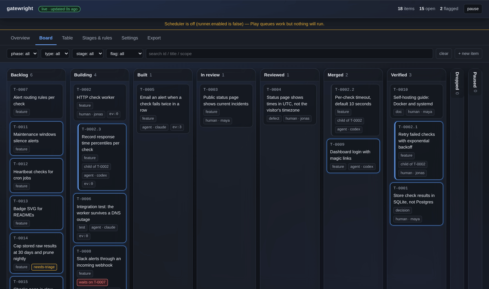
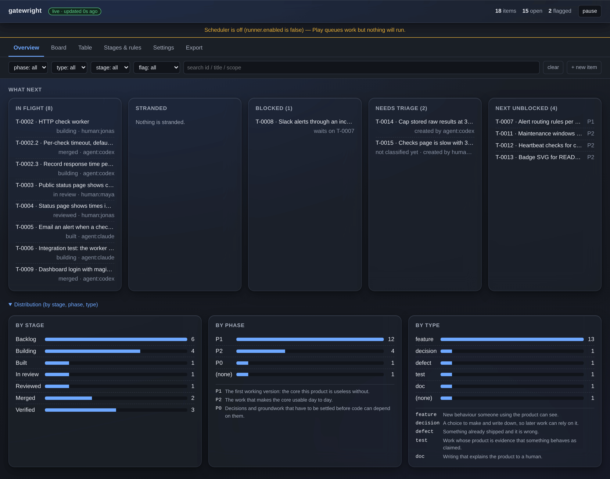

# Gatewright

Evidence-gated work tracking for coding agents. File-first, provider-agnostic, zero dependencies.

**Work that earns its way forward.**

## The problem

Every coding-agent session starts from zero: the agent doesn't know what is in flight, what is blocked, or what it was supposed to pick up next, so the human re-explains it, or the agent re-reads a wall of markdown and burns context before writing a line of code. When the session ends, the record of what happened lives in a chat transcript nobody will open again.

## The 60-second quickstart

Install once, then use `gw` from anywhere:

```sh
npm install -g gatewright        # puts `gw` on PATH
gw init
gw add "Wire the scheduler tick loop" --phase P1 --type feature --gate G0
gw claim P1-01
gw move P1-01 specified
gw move P1-01 building
gw move P1-01 built --evidence abc1234 --evidence test/scheduler.test.js
gw brief
gw open
```

No global install? Use `npx gatewright <command>` for each command instead. The package ships both `gw` and `gatewright` as binary names so a `gw` collision on your PATH is never a blocker.

`init` creates `.gatewright/` (items, events, stages, config, prompt) and writes an instruction block to `AGENTS.md`. The first store write — your first `gw add` or `gw move` — creates `.digest`. `gw open` writes `board.html`. The CLI and the live board's write API are the only write paths; the snapshot board is written on demand.

## The refusal

A card in Built has evidence because it could not have got there without it. `gw move` evaluates the target stage's exit rule from `stages.json` and refuses the move if the rule is unmet.

```
$ gw move P1-01 built
target stage requirements are not met
needs at least 1 evidence entry: run `gw move P1-01 built --evidence <e>`
$ echo $?
1
```

Add the evidence and the same command succeeds:

```
$ gw move P1-01 built --evidence abc1234 --evidence test/scheduler.test.js
P1-01  building → built  ·  evidence: abc1234, test/scheduler.test.js
```

`--force` exists to skip stages, not to skip rules. Use it when the pipeline order is wrong, not when the rule is.

## How it works

```
.gatewright/                     (created by `gw init`)
  items.jsonl    one item per line, current state
  events.jsonl   append-only, one event per line
  stages.json    stages and their exit rules
  config.json    vocab, labels, policy, runner, memory
  prompt.md      dispatch prompt template

created on the first store write (first add or move):
  .digest        SHA-256 of items.jsonl after each gw write

created by `gw open`:
  board.html     viewer snapshot with the data inlined
```

A change to one item is a one-line diff. `grep P2-01 .gatewright/events.jsonl` is the audit tool. `git log` on `.gatewright/` is the project history.

Three rules keep the data trustworthy:

- Gatewright is the only write path. The CLI, the `serve` API, `sync`, and the scheduler all call the same `store` module, so every stage move evaluates the same exit rules whether a human dragged a card or an agent ran a command.
- Agents never edit files in `.gatewright/` directly. `store` writes a hash of `items.jsonl` to `.gatewright/.digest` after every successful write; `gw check` reports a mismatch and re-baselines so the same edit is reported once, not on every run.
- The board is a snapshot, not a live page. `gw open` takes the pinned `viewer/board.html`, injects the current data as `<script type="application/json">` blocks, and writes `.gatewright/board.html`. A `file://` page cannot fetch its own data because Chrome and Firefox give it an opaque origin; inlining works in every browser with no server and no flags.

## The board

Board view:



Overview view:



The board is read-only when opened from a snapshot. `gw serve` makes it live, with editors, live run logs, triage and resume controls, global pause, and a 2-second poll for new events.

## Live board

`gw serve` serves the board on loopback and polls the store for new items and events every two seconds. Edits, moves, notes, Play, Stop, triage, resume, and global pause write back through the same rules as the CLI. When the runner is enabled, its scheduler starts eligible dispatched items and the board exposes their live logs.

```
$ gw serve --port 17888
Gatewright live board: http://127.0.0.1:17888/
```

When a move is refused, the card shows the CLI's own refusal inline. For example, a skipped-stage move returned:

```
use --force to skip stages
```

Play queues a dispatch event. The scheduler can act on that event only when its runner controls permit it. Stop cancels a queued dispatch or stops a recorded run. Global pause stops new dispatches.

## Runner and safety

The runner is a scheduler for dispatched items. Each run gets its own git worktree and `gw/<id>` branch, and its combined output is recorded under `.gatewright/runs/`.

Nothing spawns without two deliberate acts: configure a provider in `runner.providers` and set `runner.enabled: true`. A default install runs nothing; `gw serve` alone never spawns.

Work created by an agent is held with `needs-triage` by default. Held work is invisible to the scheduler until a human approves it with `gw triage <id> --approve`. This prevents a run from filing three items, each of which starts a run that files three more. Use `gw triage <id> --drop` to discard held work.

`max_children_per_item`, `max_depth`, `max_concurrent`, and `run_timeout_min` are enforced before a run starts. The runner also has three kill switches: per-run stop, `gw stop --all`, and global pause. `gw stop --all` works from any terminal with no browser and no `serve` process running, including after `serve` has crashed.

Use `gw resume <id>` to re-dispatch a paused item in its existing worktree with the previous log tail in its prompt. Use `gw gc --dry-run` to see terminal-stage worktrees that can be removed; omit `--dry-run` to remove them, or add `--force` for a dirty worktree.

## GitHub sync

Gatewright uses the GitHub CLI; it shells out to `gh` and never handles your tokens. Authenticate and enable a board for a repository, then preview and run synchronization:

```sh
gh auth login
gw init --gh --repo owner/repo
gw sync --dry-run
gw sync
```

GitHub owns intake fields; Gatewright owns execution fields, and sync never writes the latter. `agent/go` is the dispatch label, moves can post issue comments, and conflicts are flagged for review.

## Optional memory backend

Memory is off by default. When enabled, Gatewright makes only the calls in this table; the text is composed by the tracker from item fields, not generated by an agent, so enabling it cannot create an extra summarisation call or inflate a bill.

| Event | What is written |
| --- | --- |
| A run ends successfully | One deterministic line: `<repo> · <id> <title> · <from>→<to> · changed: <first line of commit message> · why: <last note or scope, up to 200 chars> · evidence: <safe evidence list>` |
| An item reaches `github.close_on` | One line in the same shape, tagged `verified`; decision items are canonical and durable |

Example memory line:

```text
owner/widget · P5-06 Record completed work · building→verified · changed: Add deterministic memory writer · why: chose deterministic text · evidence: deadbeef, lib/memory/write.js, https://ci.example.test/run/1, README.md, (+2 evidence omitted)
```

Evidence is retained only when it is a commit SHA, a repository path, or an `http(s)` URL. Other evidence is dropped and reported as `(+N evidence omitted)`; it does not silently disappear. The honest edge case is that a 32-character hexadecimal API key matches the SHA pattern and would be kept. Do not paste secrets as evidence.

Nothing else is written: not stage changes, dispatches, run lifecycle events, prompts, file contents, environment values, or evidence that is not a SHA, path, or `http(s)` URL. Recall is separate: it is used for dispatch context only when configured, and plain `gw brief` never recalls memory.

To turn memory off, set `memory.enabled` to `false` in `.gatewright/config.json` (or remove the `memory` block). Off means the provider module is not loaded and no network or transport call is made.

The complete contract, including configuration and failure behavior, is in [docs/memory.md](docs/memory.md).

On an enabled board without an authenticated GitHub CLI, the observed dry run was:

```
$ gw sync --dry-run
GitHub CLI is not authenticated. Run `gh auth login`.
```

## Commands

Every command exits 0 on success, 1 on a rule violation, 2 on a usage error, 3 on an I/O error. Every command that writes appends one event.

| Command | What it does |
| --- | --- |
| `gw init [--gh] [--repo owner/name] [--force]` | Create `.gatewright/` and write the instruction block to `AGENTS.md`; `--gh` enables GitHub sync, and `--repo` supplies the repository when no GitHub origin is available |
| `gw init --mirror claude,cursor,copilot` | Also write the instruction block to `CLAUDE.md`, `.cursor/rules/gatewright.mdc`, and `.github/copilot-instructions.md` |
| `gw brief [--me <owner>] [--json] [--recall]` | Print in-flight, blocked, owned, and next-unblocked items in 25 lines or fewer. `--recall` is accepted but has no effect until the v0.5 memory backend is enabled. |
| `gw add "<title>" [--parent ID] [--type T] [--phase P] [--priority P] [--gate G] [--scope "..."] [--by <who>]` | Create an item; print its id |
| `gw claim <id> [--by <who>]` | Take ownership |
| `gw release <id>` | Drop ownership |
| `gw move <id> <stage> [--evidence <e>...] [--by <who>] [--force]` | Advance a stage; refused if its exit rule is unmet |
| `gw edit <id> [--title ...] [--scope ...] [--priority P] [--type T] [--phase P] [--gate G] [--deps a,b] [--refs a,b] [--by <who>]` | Change non-stage, non-evidence, non-notes fields |
| `gw note <id> "<text>" [--by <who>]` | Append a timestamped line to the item's notes |
| `gw show <id> [--json]` | Print one item and its events |
| `gw list [--stage S] [--phase P] [--flag F] [--json]` | Print items as a flat list |
| `gw check [--json]` | Report rule violations and out-of-band writes; exit 1 on any report |
| `gw import <file> [--format md]` | Ingest a markdown task list. CSV and JSON are planned but not yet accepted; `--format csv` or `--format json` returns exit 2 today. |
| `gw open [--no-browser] [--watch]` | Write `board.html` and open it; `--watch` rewrites the snapshot when items or events change |
| `gw upgrade [--templates]` | Replace the CLI and the viewer, never the data |
| `gw serve [--port 7777] [--open]` | Serve the live board on loopback with its write API and, when explicitly enabled and configured, its scheduler |
| `gw sync [--dry-run]` | Pull linked GitHub issues through `gh`; `--dry-run` previews synchronization |
| `gw stop <id> \| --all` | Stop one recorded run, or all recorded runs from any terminal |
| `gw resume <id>` | Resume a paused item in its existing worktree with the previous log tail |
| `gw triage <id> --approve \| --drop` | Approve or drop an agent-created item held for review |
| `gw gc [--dry-run] [--force]` | Remove terminal-stage worktrees; dry-run previews and force permits dirty worktrees |

The full contract, including field ownership, the move algorithm, and the brief layout, is in `specs.md`.

## Using it with agents

`gw init` writes a fenced block into `AGENTS.md`. Every mainstream agent reads it. Claude Code, Codex, Cursor, and GitHub Copilot all read their own rules file, so the same content lands in the right place for each: `CLAUDE.md`, `.cursor/rules/gatewright.mdc`, and `.github/copilot-instructions.md`. `init` writes to whichever of those files already exists.

```
<!-- gatewright:start -->
## Work tracking
This repo uses gatewright. At the start of every session run `gw brief` and act on it.
- Record progress only through the `gw` CLI. Never edit files in `.gatewright/` directly.
- `gw claim <id>` before changing code for an item. `gw move <id> <stage> --evidence <commit|test|PR>` when you reach a stage.
- Work you discover that someone else could pick up: `gw add "<title>" --parent <id>`. Your own plan steps: `gw note <id>`.
- If `gw move` refuses, fix the reason; do not use --force.
<!-- gatewright:end -->
```

The agent's whole interface is `brief`, `show`, `claim`, `move`, `note`, `add`, and `edit`. It never reads the JSONL directly or GitHub. `brief` is capped at 25 lines so an agent's first action costs under 500 tokens; `show <id>` is the way to get detail on one item.

Gatewright includes adapters for Claude Code, Cursor, and Codex. The Claude Code adapter provides a `SessionStart` hook that runs `gw brief`; Cursor uses its rules file; Codex reads `AGENTS.md` directly.

## Stages and gates

`.gatewright/stages.json` defines the pipeline. The default is:

```
backlog → specified → building → built → in_review → reviewed → merged → verified
```

with `paused` and `dropped` as side states. Each stage has:

- `label` — shown on the board.
- `exit` — a human-readable description of what "done" means at this stage. Shown in the brief and the board. No machine meaning.
- `auto` — when `true`, the scheduler (v0.4) may move items into this stage. When `false`, only a human can. The default is `auto: false` for `reviewed`, `merged`, and `verified`.
- `requires` — the machine-checked rule for **entering** the next stage. Keys: `owner: true`, `evidence_min: n`, `evidence_match: regex`, `deps_at_least: stage`.

`stages.json` is the entire process definition. There is no hardcoded logic outside it. Add a stage, rename a stage, change the rule for entering `built`, mark `reviewed` as auto, drop a stage entirely — edit the JSON and `gw check` will pick it up. The board re-renders from it; `brief` reads the same file; the scheduler (when it lands) will too.

## Status

Gatewright is at v0.5.0.

Shipped in v0.1: `init`, `brief`, `add`, `claim`, `release`, `move`, `edit`, `note`, `show`, `list`, `check`, `import` (markdown only — CSV and JSON return exit 2 today), `open`, `upgrade`. Snapshot viewer with board, table, and overview views. Out-of-band write detection via `.digest`.

Shipped in v0.2: `gw serve`: a live board with write-back, editing, Play/Stop queuing, and global pause.

Shipped in v0.3: `gw sync`: GitHub issue pull/push, the `agent/go` dispatch label, comments on move, conflict flagging, and `init --gh`.

Shipped in v0.4: the runner and scheduler; one git worktree, branch, and log per run; `stop`, `resume`, `triage`, and `gc`; pre-spawn concurrency, depth, child-count, and timeout limits; held agent-created work; global and offline kill switches; Claude Code, Cursor, and Codex adapters; and live board run logs, triage, and resume.

Shipped in v0.5: an optional memory backend. Prior decisions are recalled into a dispatch prompt, and completed work and verified decisions are remembered when a run ends or an item closes. Off by default, and off means the adapter is never imported and no network call is made. The memory text is composed by the tracker from item fields, never generated by an agent, so enabling it cannot add to a model bill. See [docs/memory.md](docs/memory.md) for exactly what is written and what never is.

Not built yet:

- `gw import --format csv|json` — markdown only today; the other two exit 2.
- Mirroring agent-created child items as GitHub issues (`mirror_children`).

Node 22+. The published package has zero runtime dependencies. MIT.
